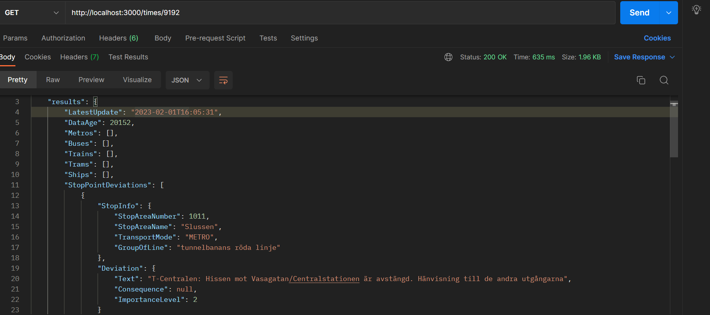

## GettingStarted
Demonstrate different components in Typescript

## ts-api-reactor
Working with traffic data in TypeScript, retrive traffic data using API

[TrafikLabs API](https://developer.trafiklab.se/)

Result image from Postman

## Useful link
[Transform Json to Typescript](https://transform.tools/json-to-typescript)
