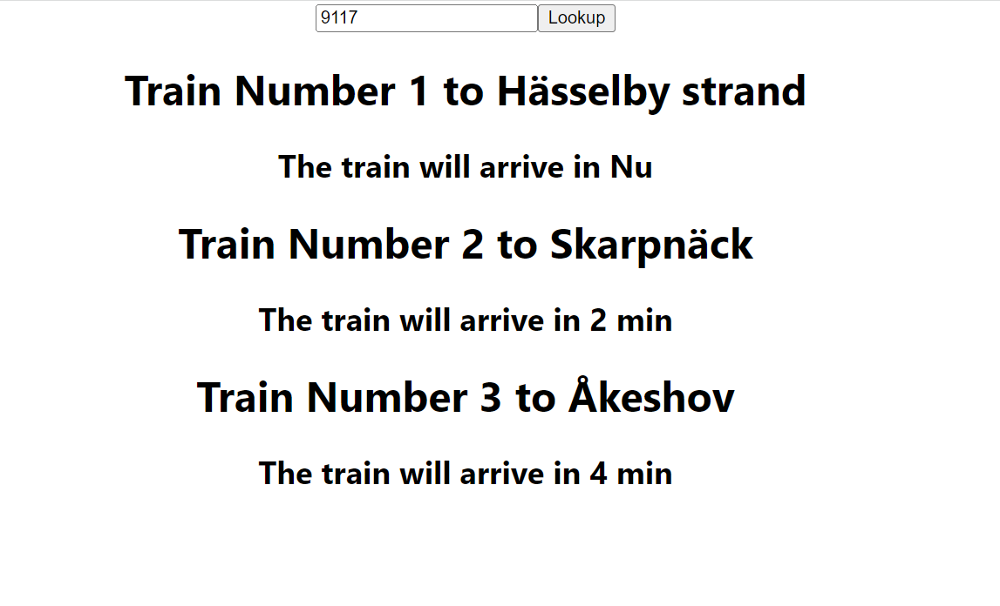

## GettingStarted
Demonstrate different components in Typescript

## ts-api-reactor
Working with traffic data in TypeScript, retrive traffic data using API

[TrafikLabs API](https://developer.trafiklab.se/)

Result image from Postman

## reactor-stockholm-ts-api-workshop-Frontend
Creating Typescript Apps with React & Node

## Useful links
[Transform Json to Typescript](https://transform.tools/json-to-typescript)

[Json Path Finder](https://jsonpathfinder.com/)

[React Typescript Cheatsheets](https://react-typescript-cheatsheet.netlify.app/)
